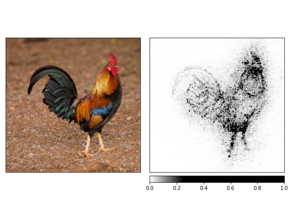

# Model Explanability

## 1. Dog Image 
**Original Image**

### Output:
**GradCam**

**GradCam++**

**SHAP**

**IG**

**IG w/ Noise Tunnel**

**Robust Perturbation**

**Occlusion**

**Captum Model Robustness**

**Perturbation**

**Salinecy1**

**Saliency2**

**SHAP**

**PGD**

## 2. Beer Image
**Original Image**

### Output:
**GradCam**

**GradCam++**

**Gradient SHAP**

**IG**

**IG w/ Noise Tunnel**

**Robust Perturbation**

**Occlusion**

**Captum Model Robustness**

**Perturbation**

**Sailency1**

**Sailency2**

**SHAP**

**PGD**

## 3. Boat Image
**Original Image**

### Output:
**GradCam**

**GradCam++**

**Gradient SHAP**

**IG**

**IG w/ Noise Tunnel**

**Robust Perturbation**

**Occlusion**

**Captum Model Robustness**

**Pertubation**

**Saliency1**

**Saliency2**

**SHAP**

**PGD**

## 4. Mobile Phone
**Original Image**

### Output:
**GradCam**

**GradCam++**

**SHAP**

**IG**

**IG w/ Noise Tunnel **

**Robust Perturbation**

**Occulusion**

**Captum Model Robustness**

**Perturbation**

**Saliency1**

**Saliency2**

**SHAP**

**PGD**

## 5. Car Image
**Original Image**

### Output:
**GradCam++**

**GradCam**

**Gradient SHAP**

**IG**

**IG w/ Noise Tunnel**

**Robust Perturbation**

**Occlusion**

**Captum Model Robustness**

**Saliency1**

**Perturbation**

**Saliency1**

**Saliency2**

**PGD**

## 6. Hen Image
**Original Image**

### Output:
**GradCam**

**GradCam++**

**SHAP**

**Robust Perturbation**

**Occulusion**

**IG**

**IG w/ Noise Tunnel**

**Captum Model Robustness**

**Saliency1**

**Perturbation**

**Saliency2**

**SHAP**

**PGD**

## 7. Ostrich Image
**Original Image**

### Output:
**GradCam++**

**GradCam**

**Gradient SHAP**

**IG**

**IG w/ Noise Tunnel**

**Robust Perturbation**

**Occulusion**

**Captum Model Robustness**

**Perturbation**

**Saliency1**

**Saliency2**

**SHAP**

**PGD**

## 8. Cat Image
**Original Image**

### Output:
**GradCam**

**GradCam++**

**Gradient SHAP**

**IG**

**IG w/ Noise Tunnel**

**Robust Perturbation**

**Occulusion**

**Captum Model Robustness**

**Perturbation**

**Saliency1**

**Saliency2**

**SHAP**

**PGD**

## 9. Tiger Image
**Original Image**

### Output:
**GradCam**

**GradCam++**

**Gradient SHAP**

**IG**

**IG w/ Noise Tunnel**

**Robust Perturbation**

**Occulusion**

**Captum Model Robustness**

**Perturbation**

**Saliency1**

**Saliency2**

**SHAP**

**PGD**

## 10. Frog Image
**Original Image**

### Output:
**GradCam**

**GradCam++**

**Gradient SHAP**

**IG**

**IG w/ Noise Tunnel**

**Robust Perturbation**

**Captum Model Robustness**

**Occulusion**

**Perturbation**

**Saliency2**

**Saliency1**

**SHAP**

**PGD**

